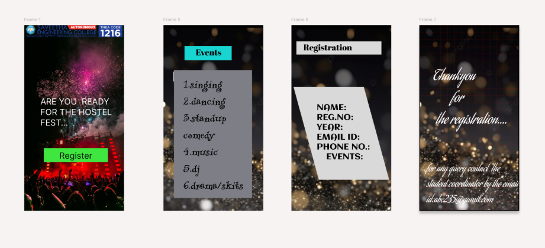

# Ex09 Event Registration Web Application
## Date:

## AIM:
To design, develop and deploy a web application for event registration.

## DESIGN STEPS:

### Step 1:
Create a new frame.

### Step 2:
Select any one preset size of your choice.

### Step 3:
Select the shapes you need.

### Step 4:
Import images as needed.

### Step 5:
Create pages based on your need and link them.

### Step 6:

Validate the HTML and CSS code.

### Step 6:

Publish the website in the given URL.

## DESIGN TOOL:
Figma

## CODE:

first page
```c
<div style="width: 413px; height: 805px; position: relative; background: white">
  
  <div style="width: 184px; height: 39px; left: 115px; top: 451px; position: absolute; background: #D9D9D9"></div>
  <div style="width: 187px; height: 40px; left: 112px; top: 450px; position: absolute; color: black; font-size: 32px; font-family: Inter; font-weight: 873; word-wrap: break-word">      LOGIN</div>
  <div style="width: 184px; height: 36px; left: 115px; top: 527px; position: absolute; background: #D9D9D9"></div>
  <div style="width: 187px; height: 36px; left: 112px; top: 527px; position: absolute; color: black; font-size: 32px; font-family: Inter; font-weight: 900; word-wrap: break-word">   REGISTER</div>
  <div style="width: 326px; height: 55px; left: 100px; top: 338px; position: absolute; color: #9E90F6; font-size: 32px; font-family: Inter; font-weight: 700; word-wrap: break-word">BADMINTON TOURNAMENT</div>
  
  
</div>
```
second page
```c
<div style="width: 453px; height: 800px; position: relative; background: white"></div>
```
third page
```c
<div style="width: 472px; height: 800px; position: relative; background: white">
  
  <div style="width: 472px; height: 58px; left: 0px; top: 44px; position: absolute; background: black"></div>
  <div style="width: 472px; height: 58px; left: 0px; top: 44px; position: absolute; text-align: center; color: white; font-size: 36px; font-family: Irish Grover; font-weight: 400; word-wrap: break-word">EVENT REGISTRATION FORM</div>
  <div style="width: 211px; height: 59px; left: 16px; top: 124px; position: absolute; background: black"></div>
  <div style="width: 210px; height: 58px; left: 17px; top: 124px; position: absolute; text-align: center; color: white; font-size: 24px; font-family: Irish Grover; font-weight: 400; word-wrap: break-word">FILL YOUR DETAILS</div>
  <div style="width: 385px; height: 35px; left: 17px; top: 216px; position: absolute; background: black"></div>
  <div style="width: 385px; height: 35px; left: 17px; top: 273px; position: absolute; background: black"></div>
  <div style="width: 385px; height: 35px; left: 17px; top: 330px; position: absolute; background: black"></div>
  <div style="width: 385px; height: 35px; left: 16px; top: 399px; position: absolute; background: black"></div>
  <div style="width: 385px; height: 35px; left: 16px; top: 460px; position: absolute; background: black"></div>
  <div style="width: 385px; height: 35px; left: 17px; top: 517px; position: absolute; background: black"></div>
  <div style="width: 385px; height: 35px; left: 16px; top: 588px; position: absolute; background: black"></div>
  <div style="width: 388px; height: 28px; left: 33px; top: 219px; position: absolute; color: white; font-size: 24px; font-family: Irish Grover; font-weight: 400; word-wrap: break-word">FULL NAME</div>
  <div style="width: 388px; height: 28px; left: 33px; top: 277px; position: absolute; color: white; font-size: 24px; font-family: Irish Grover; font-weight: 400; word-wrap: break-word">GENDER</div>
  <div style="width: 388px; height: 28px; left: 33px; top: 333px; position: absolute; color: white; font-size: 24px; font-family: Irish Grover; font-weight: 400; word-wrap: break-word">AGE</div>
  <div style="width: 388px; height: 28px; left: 33px; top: 403px; position: absolute; color: white; font-size: 24px; font-family: Irish Grover; font-weight: 400; word-wrap: break-word">REGISTER NUMBER</div>
  <div style="width: 388px; height: 28px; left: 33px; top: 466px; position: absolute; color: white; font-size: 24px; font-family: Irish Grover; font-weight: 400; word-wrap: break-word">MOBILE MUNBER</div>
  <div style="width: 388px; height: 28px; left: 33px; top: 525px; position: absolute; color: white; font-size: 24px; font-family: Irish Grover; font-weight: 400; word-wrap: break-word">EMAIL ID</div>
  <div style="width: 388px; height: 28px; left: 33px; top: 590px; position: absolute; color: white; font-size: 24px; font-family: Irish Grover; font-weight: 400; word-wrap: break-word">EVENTS TO REGISTER</div>
  <div style="width: 184px; height: 36px; left: 122px; top: 665px; position: absolute; background: #6260BA"></div>
  <div style="width: 187px; height: 36px; left: 116px; top: 665px; position: absolute; color: black; font-size: 32px; font-family: Inter; font-weight: 900; word-wrap: break-word">   REGISTER</div>
</div>
```
fourth page
```c
<div style="width: 472px; height: 800px; position: relative; background: white">
  
  <div style="width: 472px; height: 218px; left: 0px; top: 582px; position: absolute"></div>
  <div style="width: 460px; height: 207px; left: 12px; top: 593px; position: absolute; color: black; font-size: 20px; font-family: Inter; font-weight: 700; word-wrap: break-word">FOR ENQUIRES<br/>CONTACT:<br/>RAGUL E :7898867676<br/>KISHORE M:781554788<br/>RAHUL K:6786938478</div>
</div>
```


## OUTPUT:




## RESULT:
The program to design, develop and deploy a web application for event registration is completed successfully.
